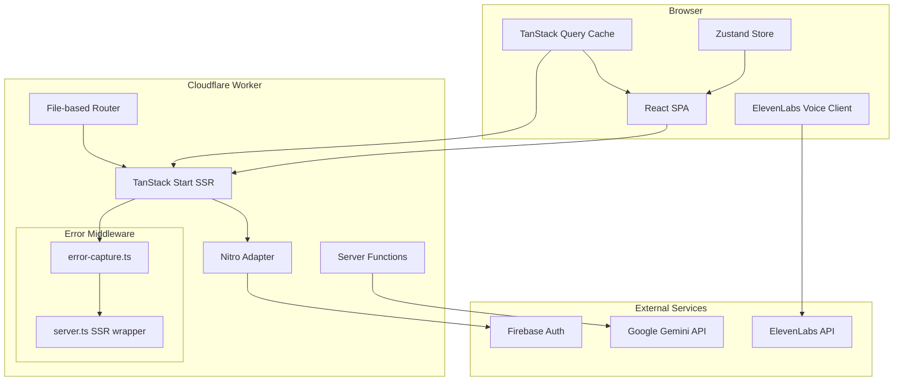

<p align="center">
  <picture>
    <source media="(prefers-color-scheme: dark)" srcset="https://img.shields.io/badge/VeriFy-8B5CF6?style=for-the-badge&logo=data:image/svg+xml;base64,PHN2ZyB3aWR0aD0iMjQiIGhlaWdodD0iMjQiIHZpZXdCb3g9IjAgMCAyNCAyNCIgZmlsbD0ibm9uZSIgeG1sbnM9Imh0dHA6Ly93d3cudzMub3JnLzIwMDAvc3ZnIj48cGF0aCBkPSJNMTIgMkwyIDd2NkMwIDE3LjUgNyAyMiAxMiAyMkMxNyAyMiAyNCAxNy41IDI0IDEzVjdMMTIgMloiIGZpbGw9IiM4QjVDRjYiLz48cGF0aCBkPSJNOSAxMi41TDEwLjUgMTRMMTUgOSIvc3Ryb2tlPSJ3aGl0ZSIgc3Ryb2tlLXdpZHRoPSIyIiBzdHJva2UtbGluZWNhcD0icm91bmQiIHN0cm9rZS1saW5lam9pbj0icm91bmQiLz48L3N2Zz4=">
  </picture>
</p>

<h1 align="center">VeriFy</h1>

<p align="center">
  <strong>Compare, Verify & Buy Smarter Across Every Store</strong>
</p>

<p align="center">
  <a href="#features"></a>
  <a href="#tech-stack"></a>
  <a href="https://github.com/kapil-77/verifybuy/blob/main/LICENSE"></a>
  <a href="#deployment"></a>
  
</p>

<br/>

<div align="center">
  
  🛒 **Product Comparison** · 🔬 **Authenticity Verification** · 🤖 **AI Diet Planner** · 🎙️ **Voice Assistant**
  
</div>

---

## 📋 Table of Contents

- [Why VeriFy?](#-why-verify)
- [What Makes It Different](#-what-makes-it-different)
- [Challenges Solved](#-challenges-solved)
- [Features](#-features)
- [Tech Stack](#-tech-stack)
- [Architecture](#-architecture)
- [Project Structure](#-project-structure)
- [Getting Started](#-getting-started)
- [Environment Variables](#-environment-variables)
- [Available Scripts](#-available-scripts)
- [API Routes](#-api-routes)
- [AI Capabilities](#-ai-capabilities)
- [Authentication](#-authentication)
- [Deployment](#-deployment)
- [Roadmap](#-roadmap)
- [Contributing](#-contributing)
- [License](#-license)
- [Acknowledgements](#-acknowledgements)

---

## ✧ Why VeriFy?

Online shopping today is fragmented. A protein powder on Amazon has different pricing, ingredients, and certifications than the same category on HealthKart or iHerb — and there's no single place to compare them all.

**VeriFy** solves this by aggregating products across multiple e-commerce platforms into one unified comparison engine. It doesn't just show prices — it breaks down ingredients, flags artificial additives, displays lab-test certifications, and even scores products on health, clean-label, and value metrics.

The result? Shoppers make informed decisions without tab-hopping between six websites.

---

## ✧ What Makes It Different

| Capability | VeriFy | Traditional Price Comparators |
|---|---|---|
| Cross-store product comparison | ✅ Side-by-side with nutrition & ingredients | ❌ Price-only |
| Authenticity & lab report verification | ✅ Downloadable certificates & badges | ❌ Not available |
| AI-powered diet planner | ✅ Personalized meal plans via Gemini | ❌ Not available |
| Voice-controlled navigation | ✅ ElevenLabs conversational AI | ❌ Not available |
| Ingredient-level comparison matrix | ✅ Yes | ❌ No |
| Health, clean-label & value scores | ✅ Triple scoring system | ❌ Ratings only |
| Dark mode / multi-currency | ✅ Both | ❌ Rarely |

---

## ✧ Challenges Solved

**1. SSR Stability on Edge**
Server-side rendering with TanStack Start on Cloudflare Workers presented unique challenges — h3 swallows thrown errors into generic 500 responses. We built a custom error-capture layer (`error-capture.ts`) that hooks into `unhandledrejection` and `error` events, coupled with a response-normalization middleware in `server.ts` that detects swallowed "HTTPError" JSON bodies and returns a proper HTML error page instead.

**2. Real-Time Voice Integration in SPA**
Integrating ElevenLabs Conversational AI into a single-page app required careful lifecycle management — establishing WebRTC audio streams, handling mic permissions gracefully across browsers, and wiring client-side tools (`navigateTo`, `addToCompare`, `toggleTheme`) so the voice assistant can manipulate the app state in real time.

**3. AI Plan Generation with Graceful Fallback**
The diet planner uses Gemini to generate structured meal plans via the Vercel AI SDK. If the model fails to produce valid JSON (or the API is unreachable), the system falls back to a deterministic plan computed from Mifflin–St Jeor equations — ensuring the UI never crashes and the user always gets actionable data.

**4. Routing Without Next.js Conventions**
TanStack Start uses file-based routing but with different conventions than Next.js or Remix. We documented the routing rules in `src/routes/README.md` to prevent confusion between `$param`, `_layout`, `splat`, and `__root` patterns.

---

## ✧ Future Work To Do

**1. Products Scrapping pipeline**

🔄 Integrate a robust scraping pipeline to fetch real-time product prices, availability, ratings, and specifications from trusted e-commerce platforms.

**2. Purchase Tracking**

💰 Implement a purchase tracking functionlity to verify successful purchases originating from VerifyBuy and enable reward points, cashback, or referral commissions.


## ✧ Features

### 🔍 Cross-Store Product Comparison
- Select up to 4 products and view them side-by-side
- Compare **Overview**, **Ingredients**, **Pros & Cons**, and **Nutrition** in tabbed views
- Automatic "Best" highlighting for lowest price, highest rating, or best macros
- Persistent compare bar floating at the bottom of every page

### 🔬 Authenticity & Lab Verification
- Every product displays manufacturer, country of origin, and certifications (FSSAI, GMP, ISO, etc.)
- Downloadable lab report buttons on certification badges
- Verified badge for authenticated products

### 🤖 AI Diet Planner
- Forms-based input for age, sex, height, weight, activity level, gym focus, and dietary preferences
- Generates a full-day, 4-meal plan with calorie targets and macronutrient breakdown
- Powered by Google Gemini via the Vercel AI SDK with deterministic fallback
- Supports vegetarian, vegan, and halal preferences

### 🎙️ Voice Assistant
- Conversational AI interface using ElevenLabs Conversational AI
- Navigate pages, add/remove products from comparison, open categories, toggle theme
- Real-time transcription and status indicators
- Graceful error handling for mic permissions and missing hardware

### 💰 Rewards & Gamification
- Earn **coins** for "Buy Now" actions and **points** for confirmed purchases
- Tier system (Bronze → Silver → Gold → Platinum) with increasing perks
- Activity history tracking
- Progress bar toward next tier

### 🎨 UI/UX
- Fully responsive design (mobile → desktop)
- Dark/light theme with system-preference detection and zero-flash hydration
- Multi-currency support (USD, INR, EUR, GBP, AED, CAD, AUD, JPY)
- Animated starfield background on the hero section
- Smooth page transitions with Framer Motion
- Toast notifications for all user actions

---

## 🛠️ Tech Stack

| Category | Technology |
|---|---|
| **Framework** | [React 19](https://react.dev/) + [TypeScript](https://www.typescriptlang.org/) |
| **Meta-Framework** | [TanStack Start](https://tanstack.com/start/latest) (SSR) |
| **Routing** | [TanStack Router](https://tanstack.com/router/latest) (file-based) |
| **Data Fetching** | [TanStack Query](https://tanstack.com/query/latest) |
| **Styling** | [Tailwind CSS v4](https://tailwindcss.com/) + `tw-animate-css` |
| **UI Components** | [Radix UI](https://www.radix-ui.com/) primitives + [shadcn/ui](https://ui.shadcn.com/) |
| **Animation** | [Framer Motion](https://www.framer.com/motion/) |
| **State Management** | [Zustand](https://github.com/pmndrs/zustand) with persistence |
| **AI SDK** | [Vercel AI SDK v7](https://sdk.vercel.ai/) + `@ai-sdk/openai-compatible` |
| **Voice AI** | [ElevenLabs Conversational AI](https://elevenlabs.io/) |
| **Auth** | [Firebase Auth](https://firebase.google.com/products/auth) |
| **Charts** | [Recharts](https://recharts.org/) |
| **Icons** | [Lucide React](https://lucide.dev/) |
| **Forms** | [React Hook Form](https://react-hook-form.com/) + [Zod](https://zod.dev/) |
| **Build Tool** | [Vite v8](https://vitejs.dev/) |
| **Deployment** | [Cloudflare Workers](https://workers.cloudflare.com/) (via Nitro) |
| **Linting** | ESLint + Prettier + TypeScript-ESLint |

---

## 🏗️ Architecture



**Data Flow:**
1. Client renders via TanStack Start SSR — initial HTML is server-rendered
2. Client-side navigation uses TanStack Router with preloaded route data
3. Server Functions (`createServerFn`) handle AI calls, auth verification, and API proxying
4. Zustand persists user preferences (currency, theme, compare list, wishlist) to localStorage
5. Voice assistant establishes WebRTC connection to ElevenLabs; client-side tools manipulate app state directly

---

## 📁 Project Structure

```
├── public/
│   └── images/                     # Static assets (brands, products, certifications)
│
├── src/
│   ├── components/
│   │   ├── auth/                   # AuthCard, AuthModal, EmailForm, SocialButton
│   │   ├── layout/                 # Navbar, Footer
│   │   ├── product/                # ProductCard
│   │   ├── profile/                # ActivityTimeline
│   │   └── ui/                     # 40+ Radix/shadcn UI components
│   │
│   ├── hooks/
│   │   ├── useAuth.tsx             # Firebase auth context & provider
│   │   ├── useTheme.tsx            # Dark/light theme with hydration-safe bootstrap
│   │   ├── use-mobile.tsx          # Responsive breakpoint detection
│   │   └── useScrolled.ts          # Scroll position hook for navbar
│   │
│   ├── lib/
│   │   ├── activity.ts             # Activity tracking types & factory
│   │   ├── api.ts                  # Backend API client
│   │   ├── auth.ts                 # Firebase auth functions
│   │   ├── data.ts                 # Product types, brand/category helpers, currencies
│   │   ├── diet.functions.ts       # AI diet planner (server function)
│   │   ├── error-capture.ts        # Global error capture for SSR
│   │   ├── error-page.ts           # HTML fallback error page
│   │   ├── firebase.ts             # Firebase initialization
│   │   ├── store.ts                # Zustand store (compare, wishlist, points, auth)
│   │   ├── utils.ts                # cn() utility (clsx + tailwind-merge)
│   │   └── utils/
│   │       └── images.ts           # Image path builders
│   │
│   ├── routes/
│   │   ├── __root.tsx              # Root layout (shell, providers, navbar, footer)
│   │   ├── index.tsx               # Homepage (hero, categories, trending, newsletter)
│   │   ├── assistant.tsx           # AI Diet Planner page
│   │   ├── categories.tsx          # Browse & filter products
│   │   ├── compare.tsx             # Product comparison table
│   │   ├── profile.tsx             # Auth page (sign in / sign up)
│   │   ├── product.$slug.tsx       # Product detail page with charts
│   │   ├── rewards.tsx             # Gamification & loyalty tiers
│   │   ├── api/
│   │   │   └── elevenlabs.token.ts # Server-side ElevenLabs token proxy
│   │   └── README.md               # Routing conventions documentation
│   │
│   ├── seed/
│   │   ├── brands.ts               # Brand seed data
│   │   ├── categories.ts           # Category tree (Supplements, Foods, Skincare, etc.)
│   │   ├── certifications.ts       # Certification seed data
│   │   └── products/               # Product seed data
│   │       ├── index.ts
│   │       ├── supplements.ts
│   │       └── otherCategories.ts
│   │
│   ├── router.tsx                  # Router instance with QueryClient
│   ├── routeTree.gen.ts            # Auto-generated route tree (do not edit)
│   ├── server.ts                   # SSR error-wrapping entry point
│   ├── start.ts                    # TanStack Start configuration
│   └── styles.css                  # Tailwind CSS with custom design tokens
│
├── .env.example                    # Environment variable template
├── .gitignore
├── .prettierrc
├── .prettierignore
├── components.json                 # shadcn/ui configuration
├── eslint.config.js
├── package.json
├── tsconfig.json
└── vite.config.ts
```

---

## 🚀 Getting Started

### Prerequisites

- **Node.js** >= 18
- **npm** >= 9
- (Optional) **Cloudflare account** for deployment

### Installation

```bash
# Clone the repository
git clone https://github.com/kapil-77/verifybuy.git
cd verifybuy

# Install dependencies
npm install

# Copy environment variables and fill them in
cp .env.example .env
```

### Development

```bash
# Start the dev server (Vite + HMR)
npm run dev
```

The app will be available at **http://localhost:8080**.

> **Note:** The dev server runs on port 8080. To change this, update the `server.port` value in `vite.config.ts`.

### Build

```bash
# Production build (client + SSR + Nitro/Cloudflare)
npm run build

# Development build (useful for debugging SSR)
npm run build:dev
```

### Preview

```bash
# Preview the production build locally
npm run preview
```

### Lint & Format

```bash
# Run ESLint
npm run lint

# Auto-format with Prettier
npm run format
```

---

## 🔐 Environment Variables

Create a `.env` file in the project root:

```bash
# ─── ElevenLabs Voice Assistant ───
# Get your API key at https://elevenlabs.io/app/settings/api-keys
ELEVENLABS_API_KEY=sk_xxxxxxxxxxxxxxxxxxxxxxxx

# ─── Google Gemini AI (Diet Planner) ───
# Get your API key at https://aistudio.google.com/apikey
GEMINI_API_KEY=AIzaXXXXXXXXXXXXXXXXXXXXXXXXXX

# ─── Firebase Authentication ───
# Find these in your Firebase Console → Project Settings → General → Web Apps
VITE_FIREBASE_API_KEY=AIzaXXXXXXXXXXXXXXXXXXXXXXXXXX
VITE_FIREBASE_AUTH_DOMAIN=your-project.firebaseapp.com
VITE_FIREBASE_PROJECT_ID=your-project-id
VITE_FIREBASE_STORAGE_BUCKET=your-project.firebasestorage.app
VITE_FIREBASE_MESSAGING_SENDER_ID=123456789
VITE_FIREBASE_APP_ID=1:123456789:web:abcdef123456

# ─── Optional: Backend API URL (for auth verification) ───
VITE_API_URL=http://localhost:3001
```

> All `VITE_` prefixed variables are exposed to the client bundle. Never store secrets in `VITE_` variables.

---

## 📦 Available Scripts

| Script | Description |
|---|---|
| `npm run dev` | Start development server with HMR |
| `npm run build` | Production build for Cloudflare Workers |
| `npm run build:dev` | Build in development mode |
| `npm run preview` | Preview the production build |
| `npm run lint` | Run ESLint across the project |
| `npm run format` | Auto-format with Prettier |

---

## 🌐 API Routes

### `POST /api/elevenlabs/token`

Proxies a signed token request to ElevenLabs Conversational AI. Used by the voice assistant to establish a WebRTC session.

**Request body:** (none — server injects API key from environment)

**Response:**
```json
{
  "token": "eyJhbGciOiJSUzI1NiIsInR5cCI6IkpXVCJ9..."
}
```

**Error response:**
```json
{
  "error": "ElevenLabs not connected"
}
```

---

## 🤖 AI Capabilities

### Diet Planner (`/assistant`)

The diet planner uses a server function (`createServerFn`) to call Google Gemini's OpenAI-compatible endpoint:

1. User fills out a 10-field form (age, sex, height, weight, activity, gym focus, goal, diet preference, allergies)
2. Client calls `generateDietPlan` server function via `useServerFn`
3. Server computes BMR/TDEE targets using the Mifflin–St Jeor equation
4. Gemini generates a structured JSON meal plan via `generateText` with `Output.object()`
5. If AI fails, a deterministic fallback plan is returned immediately

**Model:** `google/gemini-3-flash-preview` via `@ai-sdk/openai-compatible`

### Voice Assistant (`VoiceAssistant`)

The voice assistant uses ElevenLabs Conversational AI with custom **client-side tools**:

| Tool Name | Description |
|---|---|
| `navigateTo` | Navigate to any page (home, categories, compare, etc.) |
| `searchCategory` | Filter products by keyword |
| `openProduct` | Open a product detail page by slug or name |
| `addToCompare` | Add a product to the comparison list |
| `removeFromCompare` | Remove a product from the comparison list |
| `clearCompare` | Clear the entire comparison list |
| `openCompare` | Navigate to the compare page |
| `openDietPlanner` | Navigate to the diet planner |
| `scrollToSection` | Scroll to a specific section by ID |
| `toggleTheme` | Toggle dark/light mode |

---

## 🔑 Authentication

VeriFy uses **Firebase Authentication** with three providers:

- **Google** — OAuth popup via `signInWithPopup`
- **GitHub** — OAuth popup via `signInWithPopup`
- **Email/Password** — `createUserWithEmailAndPassword` / `signInWithEmailAndPassword`

**Flow:**
1. User authenticates on the `/profile` page
2. Firebase SDK returns a `User` object mapped to `AuthUser` (uid, displayName, email, photoURL)
3. Zustand store updates `authUser` state (persisted across sessions)
4. The navbar switches to a profile avatar with dropdown (display name, email, logout)

**Backend verification:** The optional backend API (`sendIdTokenToBackend`) sends the Firebase ID token via `Authorization: Bearer <token>` for server-side session verification.

---

## 🌍 Deployment

### Cloudflare Workers (Recommended)

This project is pre-configured for deployment to Cloudflare Workers via Nitro:

```bash
# 1. Build for production
npm run build

# 2. Deploy using Nitro
npx nitro deploy --prebuilt
```

The build generates a `wrangler.json` and `.wrangler/deploy/config.json` automatically.

### Environment Variables for Production

Set the following in your Cloudflare Dashboard → Workers → verify → Settings → Variables:

| Variable | Type | Description |
|---|---|---|
| `ELEVENLABS_API_KEY` | Secret | ElevenLabs API key |
| `GEMINI_API_KEY` | Secret | Google Gemini API key |
| `VITE_FIREBASE_API_KEY` | Plain text | Firebase web API key |
| `VITE_FIREBASE_AUTH_DOMAIN` | Plain text | Firebase auth domain |
| `VITE_FIREBASE_PROJECT_ID` | Plain text | Firebase project ID |
| `VITE_FIREBASE_STORAGE_BUCKET` | Plain text | Firebase storage bucket |
| `VITE_FIREBASE_MESSAGING_SENDER_ID` | Plain text | Firebase sender ID |
| `VITE_FIREBASE_APP_ID` | Plain text | Firebase app ID |

---

## 🗺️ Roadmap

- [x] Cross-store product comparison engine
- [x] AI-powered diet planner with Gemini
- [x] Voice-controlled navigation via ElevenLabs
- [x] Firebase authentication (Google, GitHub, Email)
- [x] Rewards & gamification system
- [x] Dark/light theme with zero-flash hydration
- [x] Multi-currency support
- [ ] Real product data integration via e-commerce APIs
- [ ] Price history tracking & alerts
- [ ] User reviews & ratings
- [ ] Mobile application (React Native)
- [ ] Barcode scanner for instant product lookup
- [ ] Community-driven lab report uploads

---

## 🤝 Contributing

Contributions are welcome and encouraged!

1. **Fork** the repository
2. **Create a branch** (`git checkout -b feature/amazing-feature`)
3. **Commit your changes** (`git commit -m 'Add amazing feature'`)
4. **Push to the branch** (`git push origin feature/amazing-feature`)
5. **Open a Pull Request**

**Guidelines:**
- Follow the existing code style (Prettier + ESLint)
- Add TypeScript types for all new APIs and data structures
- Use `createServerFn` for any server-side logic that needs client invocation
- Keep components focused and testable
- Update `seed/` data when adding new product categories or brands

---

## 📄 License

This project is licensed under the **MIT License**. See the [LICENSE](LICENSE) file for details.

---

## 🙏 Acknowledgements

- [TanStack](https://tanstack.com/) — React Router, React Query, and React Start
- [shadcn/ui](https://ui.shadcn.com/) — Beautifully designed Radix UI components
- [Vercel AI SDK](https://sdk.vercel.ai/) — First-class AI integration for TypeScript
- [ElevenLabs](https://elevenlabs.io/) — Conversational AI voice technology
- [Google Gemini](https://deepmind.google/technologies/gemini/) — AI model for diet planning
- [Firebase](https://firebase.google.com/) — Authentication infrastructure
- [Lucide](https://lucide.dev/) — Open-source icon library
- [Cloudflare](https://www.cloudflare.com/) — Edge deployment platform

---

<p align="center">
  Built with ❤️ by <a href="https://github.com/kapil-77">Kapil</a>
</p>

<p align="center">
  <a href="https://github.com/kapil-77/verifybuy">
    
  </a>
  <a href="https://github.com/kapil-77/verifybuy/fork">
    
  </a>
</p>
